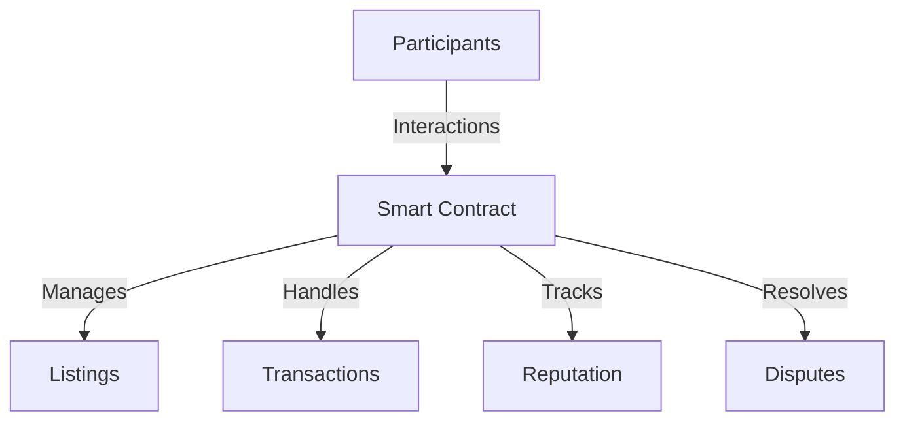

# DeFi Template - Decentralized Marketplace Smart Contract

A comprehensive Clarity smart contract template for building decentralized, trustless marketplace applications on the Stacks blockchain.

## 🌐 Overview

DeFi Template provides a robust, flexible framework for creating peer-to-peer marketplaces with built-in security, reputation, and dispute resolution mechanisms.

### Key Features

- 🔐 Trustless escrow system
- 📋 Flexible product listing management
- 🤝 Reputation tracking
- ⚖️ Integrated dispute resolution
- 🌈 Extensible design

## 🏗️ Architecture



### Core Components

1. **Dynamic Listing Management**
2. **Secure Transaction Escrow**
3. **User Reputation System**
4. **Flexible Dispute Resolution**

## 🚀 Getting Started

### Prerequisites

- [Clarinet](https://github.com/hirosystems/clarinet)
- Stacks Wallet
- Basic Clarity understanding

### Installation

```bash
git clone https://github.com/your-org/defi-template
cd defi-template
clarinet test
```

## 💡 Usage Examples

### Create a Listing

```clarity
(contract-call? .marketplace create-listing 
    "Premium Item"
    "High-quality product description"
    u1000000  ;; Price (microSTX)
    (some "https://example.com/image")
    "Electronics"
    u10  ;; Quantity
)
```

### Purchase Workflow

```clarity
;; Purchase an item
(contract-call? .marketplace purchase-item 
    u1       ;; Listing ID
    u1       ;; Quantity
    "Delivery Address"
)

;; Confirm receipt
(contract-call? .marketplace confirm-receipt u1)
```

## 🛡️ Security Considerations

- Comprehensive access control
- Built-in dispute mechanisms
- Reputation-based trust system

### Potential Improvements

- Multi-sig dispute resolution
- Oracle-based rating validation
- Advanced anti-Sybil mechanisms

## 🤝 Contributing

1. Fork the repository
2. Create a feature branch
3. Commit your changes
4. Push and create a Pull Request

## 📜 License

[MIT License](LICENSE)

## 🏷️ Version

v0.1.0 - Initial Release